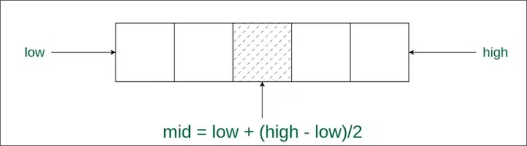

# Searching 

## Linear Searching

Most commonly used one and the most basic one basically searches from one of end to other end one by one.
```c
int search(int arr[], int N, int x)
{
    for (int i = 0; i < N; i++)
        if (arr[i] == x)
            return 1; // If its present return 1
    return 0; // If not than return 0
}
```

## Binary Searching

Used to find the position of a target value within a sorted array.

### Process

- Divide the search space into two halves by finding the middle index “mid”.

- Compare with the middle element.
- if num found return 1
- if not choose which side to work on left or right and then find its middle element 
- and repeat the above two steps till you get your element that is to be found

# Runtimes

Here we will discuss about time complexity of a program.

## Big O Notation

In general we will encounter these time complexities most of the time:

- O(1) 
- O(n)
- O(n^2)
- O(nlogn)
- O(logn)

### A question you might have is what is this big O

This big O is basically the worst case we consider.
That is, big O means the most number of steps this can take.

We also have something called omega notation which is the least number of cases in which we can search/do something.

Let say: We need to find someones name in a phonebook and we transvere through each page one by one.
- This process will have a time complexity of **O(n)**, where **n represents the total number of pages**. 
- So even though we might get our required name on page 1, we still will have the time complexity of the process to be O(n)

Now let say we are moving two pages at a time, so you would say time complexity has changed to O(n/2).
> But when considering the time complexity we don't consider the constants in general.

So we can say that 
- Linear Search - O(n), Omega(1)
- Binary Search - O(logn), Omega(1)

Some algorigthms might have these Big O and Omega notation to be same for example linear counting when we count each and every object one by one.
It's time complexity would be O(n) and Omega(n), here we have B**ig O and Omega notation to be same and for these we have theta notation.**

**Theta notation** represents that this algorithm has same Big O and Omega representation.

# Structs

## Declaring a struct

```c
typedef struct{
    // datatype variable_name;
    int digts;
    int numbers[n];

}struct_name
```

# Sorting

## Selection Sort

What this basically does is it selects the smallest element by going thru the array until array reaches to it's end.
When array comes to an end it swaps the element in the 0th index with the smallest digit.
Thus placing the smallest digit in start now it starts the loop from 1st index as we have already got our smallest number.

